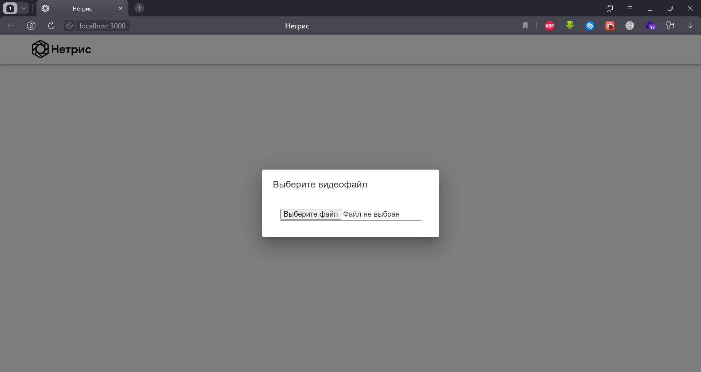
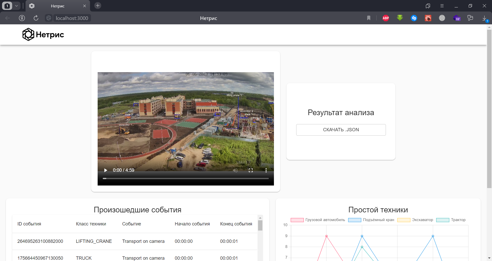

<p align="center">
 <br/>
<H2 align="center">Кейс №4 Команда Winstrike</H2>
</p>

> Команда Winstrike представляет программный модуль видеоаналитики с обзорных камер строительных объектов.

## Функциональность

### Загрузка видеофайла


### Главная страница


### Результат распознования


```Решение позволяет:```
- _Определять типы используемой техники, время её работы и простоя_
- _Формировать файл-ведомости производимых процессов на площадке_
- _Удобное табличное представление всех событий на строительной площадке_
- _Анализ простоя строительной техники в виде графического представления_

## Установка и запуск

### Frontend
Для установки всех зависимостей проекта требуется выполнить:

**npm:**

```sh
npm install
```

**yarn:**

```sh
yarn add all
```

Запуск производится командой:
```sh
npm start
```


### Backend
Для установки всех зависимостей проекта требуется выполнить:
```sh
pip install -r requirements.txt
```

Запуск производится запуском файла `backend.py`

## Пример обработанного видео на примере скринкаста
[Скринкаст данного кейса](https://disk.yandex.ru/i/MHaNbqGFjmGE-g)

[Пример обработки файла](https://disk.yandex.ru/i/OxW_X90b7K-nuw)


Все права защищены. &copy; Winstrike.
